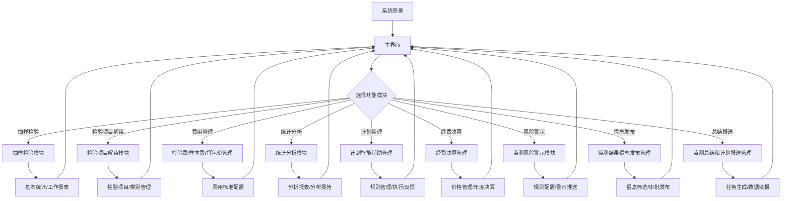
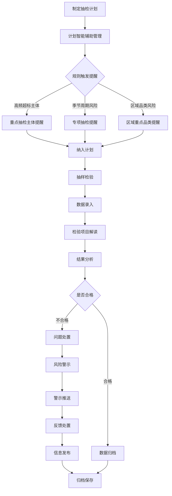
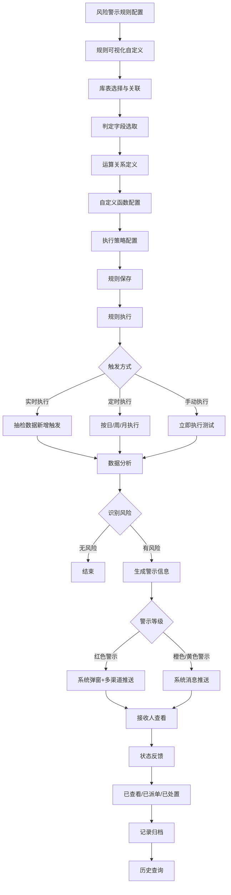
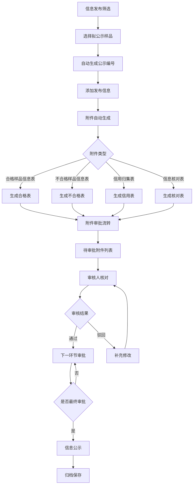
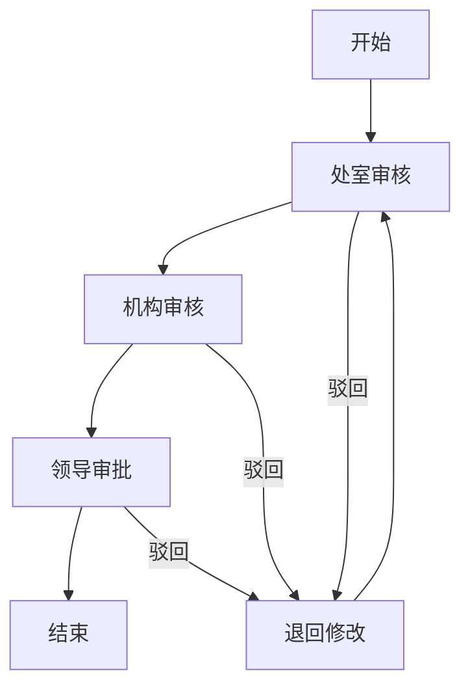
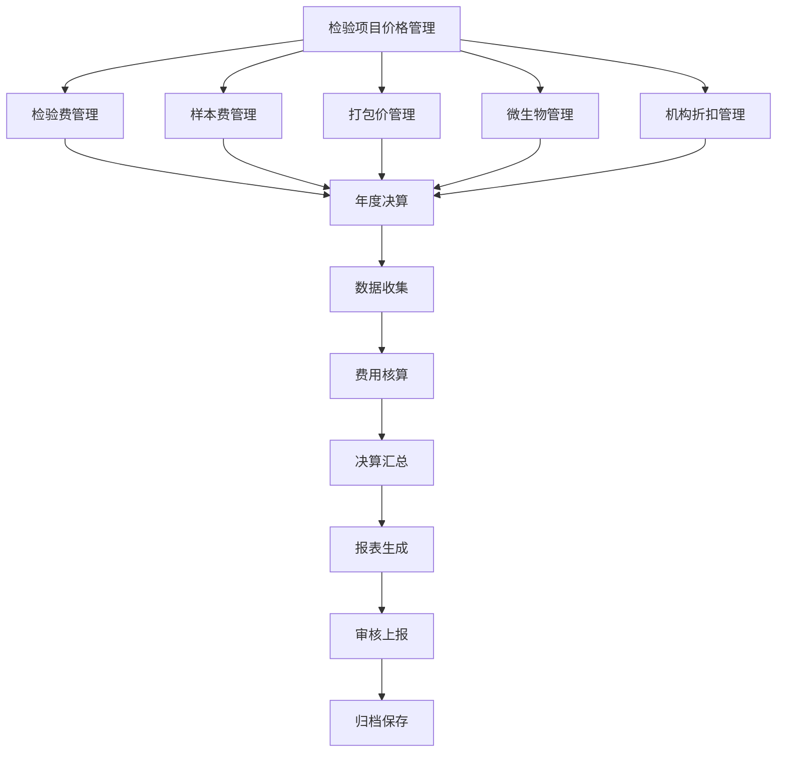
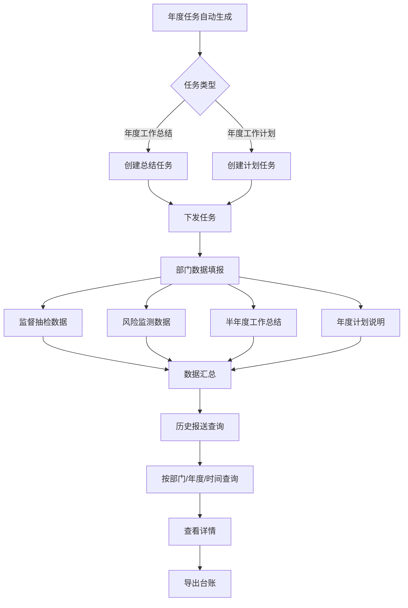
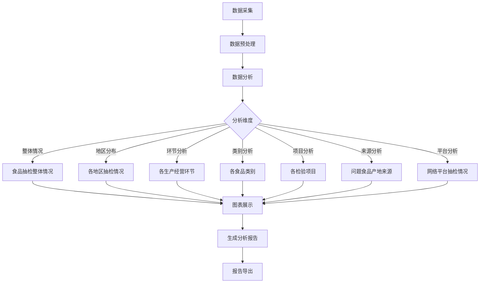
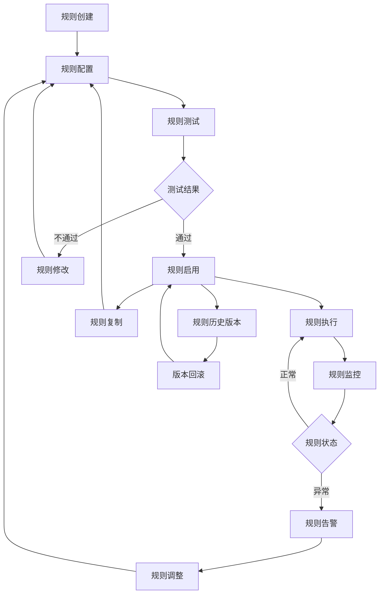
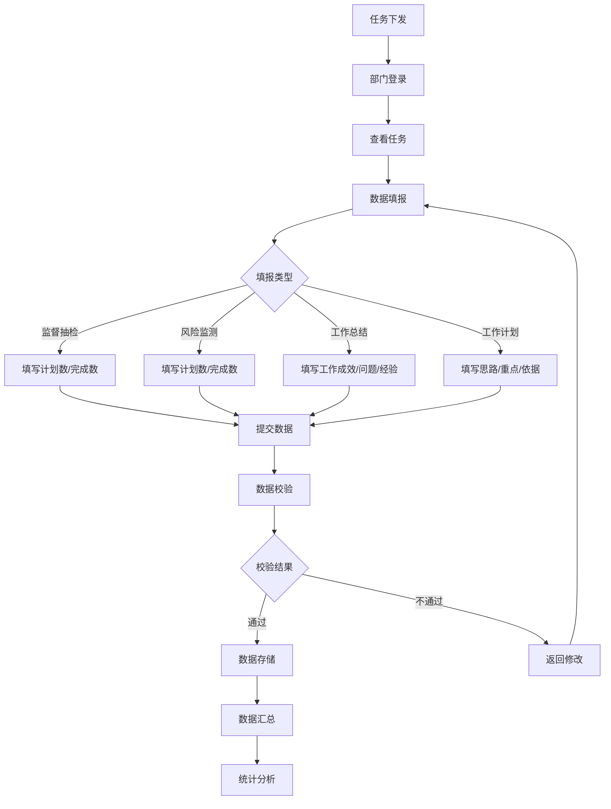

# 北京市食品安全全链条数字化平台 - 系统流程图

## 1. 系统主流程

## 2. 抽检工作主流程

## 3. 风险警示流程

## 4. 信息发布流程

## 5. 审批流程可视化

## 6. 经费决算流程

## 7. 总结报送流程

## 8. 统计分析流程

## 9. 规则管理流程

## 10. 数据填报流程

---

**文档版本**：V1.0  
**编制日期**：2026年7月6日  
**说明**：以上流程图使用Mermaid语法绘制，可在支持Mermaid的工具中渲染查看