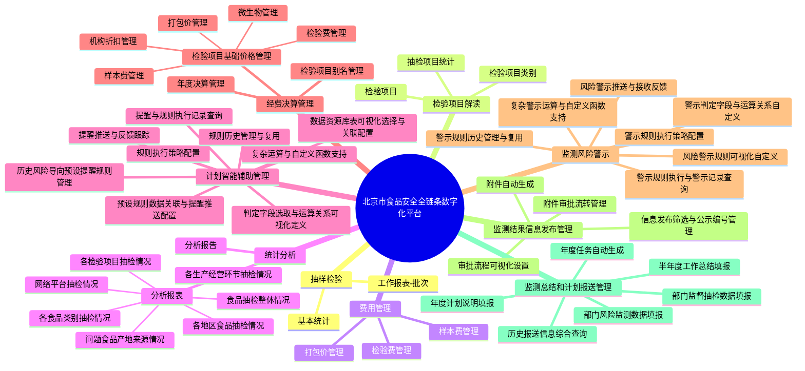
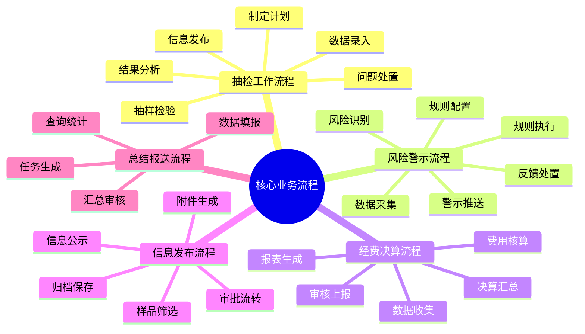
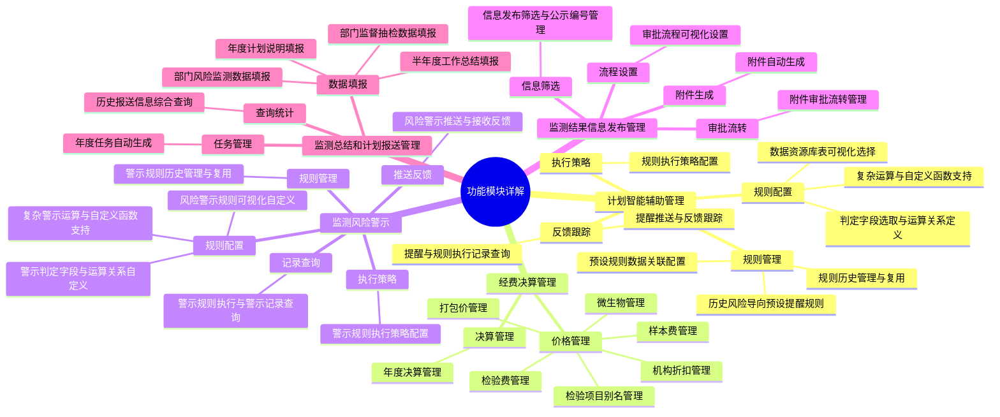
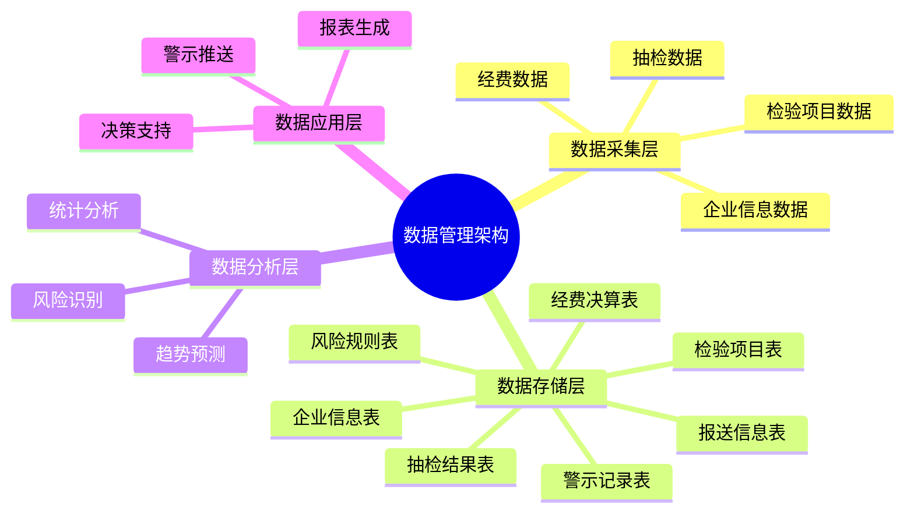
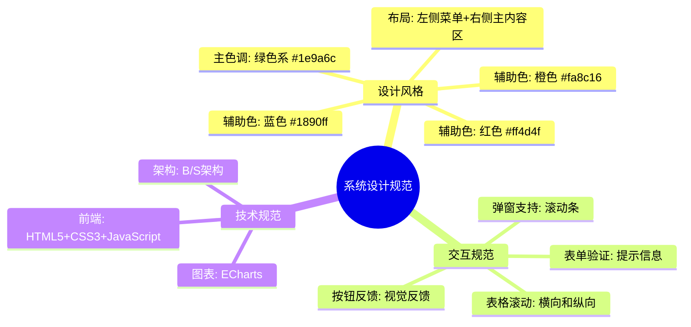
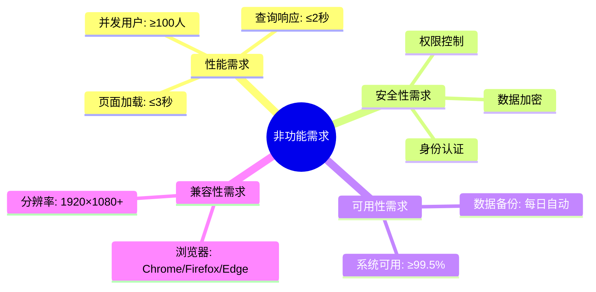

# 北京市食品安全全链条数字化平台 - 系统脑图

## 系统架构总览

## 核心业务流程

## 功能模块详解

## 数据管理架构

## 系统设计规范

## 非功能需求

---

**文档版本**：V1.0  
**编制日期**：2026年7月6日  
**说明**：以上脑图使用Mermaid语法绘制，可在支持Mermaid的工具中渲染查看。建议使用Mermaid Live Editor（https://mermaid.live/）或VS Code的Mermaid扩展查看。