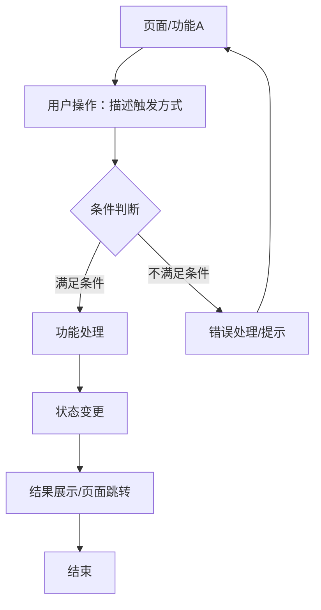

# 产品需求：[原型名称]

## 1. 背景与目标
- 业务背景：[为什么要做这个功能/页面，解决什么业务问题]
- 项目目标：[本次交付要达成的核心目标]

## 2. 目标用户
- 主要用户：[谁在使用，角色/岗位/场景]
- 用户特征：[技术水平、使用频率、核心诉求]
- 次要用户：[如有]

## 3. 核心任务
[用户最关键的操作任务，按优先级排列]

## 4. 功能流程

流程说明：

| 节点 | 说明 |
|------|------|
| 页面/功能 | 用户当前所处的页面或正在使用的功能 |
| 用户操作 | 触发流程的用户行为，如点击按钮、填写表单、选择筛选条件 |
| 条件判断 | 系统校验或业务规则判断，决定流程走向 |
| 功能处理 | 系统执行的核心逻辑，如数据计算、存储、调用接口 |
| 状态变更 | 数据或界面状态的变化 |
| 结果展示 | 成功后的界面反馈或页面流转 |
| 错误处理 | 不满足条件时的反馈方式和回流路径 |

### 4.1 页面级总流程
[用 Mermaid graph LR/TB 展示各页面之间的流转关系]

### 4.2 核心功能子流程
[按核心任务拆分，为每个关键功能提供独立的 Mermaid 流程图]

## 5. 功能清单
### 5.1 功能点列表
| 编号 | 功能点 | 优先级 | 说明 |
|------|--------|--------|------|
| F01  | [名称] | P0/P1/P2 | [做什么、解决什么问题] |

### 4.2 功能点详细描述
#### F01 [功能名称]
- 需求描述：[详细描述功能需求，包括触发条件、前置条件和预期结果]
- 功能设计：[功能实现方式、界面元素、交互逻辑概述]
- 操作流程：[步骤1 → 步骤2 → 步骤3]
- 功能交互：[按操作逐条列出交互细节，格式：操作（触发元素+事件）→ 交互响应（动画/状态变化/数据变更）→ 页面效果（UI 变化），如：点击列表项（<Card onClick>）→ 展开详情抽屉（slideIn 300ms）→ 抽屉内加载详情数据并显示；点击提交按钮（<Button onClick>，按钮置灰防重复提交）→ 调用存储 → 成功后关闭抽屉 + 列表项状态标签更新 + Toast 提示"提交成功"]
- 功能数据项：[与该功能相关的数据字段，如字段名、类型、校验规则]
- 数据状态：[数据项的状态及不同状态下的交互差异，如审批状态包含待审批/通过/不通过，不同状态显示不同操作]
- 约束条件：[权限控制、数据范围、业务规则等约束]
- 排序规则：[数据项的排序规则，如按时间降序、按名称升序等]
- 其他细节：[异常处理、性能要求、安全考虑等]

（每个功能点均按此结构展开）

## 5. 内容与数据
- 数据来源：[真实数据 / 文档推断 / 示例数据 / 接口]
- 素材来源：[用户提供 / 主题资源 / 待补充]
- 数据总览：[页面级别的数据实体关系和关键字段概览；具体字段见各功能点的功能数据项]

## 6. 页面与状态
- 页面列表：[涉及哪些页面/视图，各页面包含的功能点]
- 核心路径：[用户典型操作流程]
- 页面状态：[空状态 / 加载中 / 错误 / 成功等页面级状态]
- 边界情况：[极端数据、特殊权限、并发操作等]

## 7. 范围与边界
- 本轮做：[列出]
- 本轮不做：[列出]
- 后续规划：[如有]
