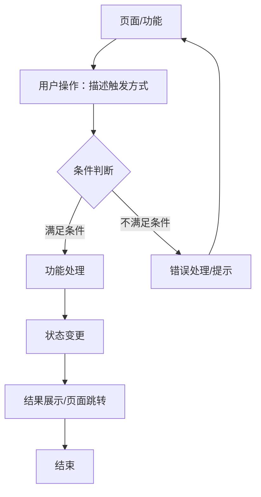
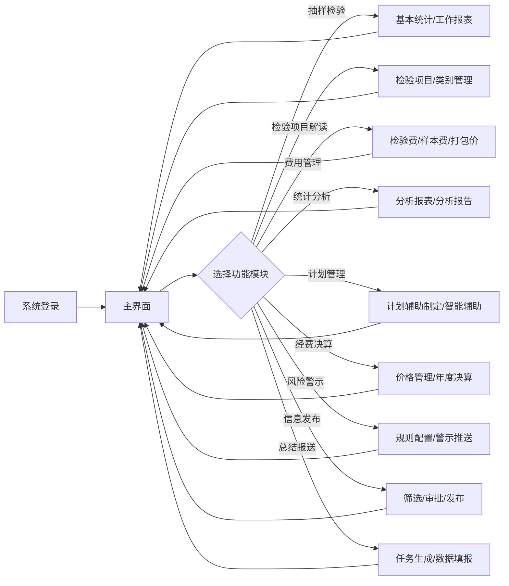
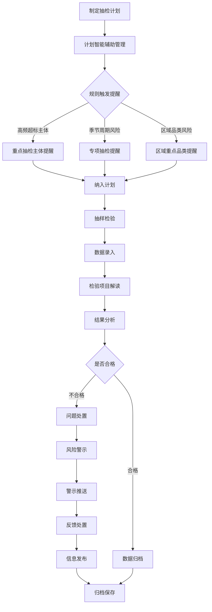
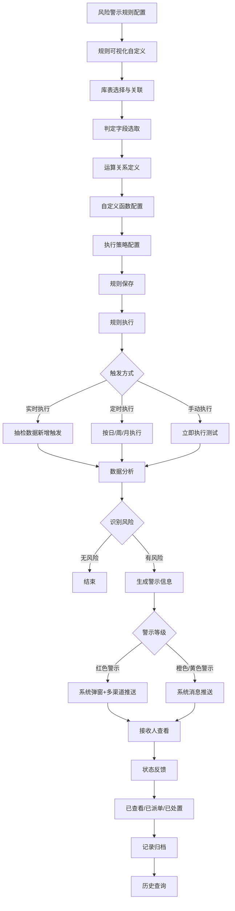
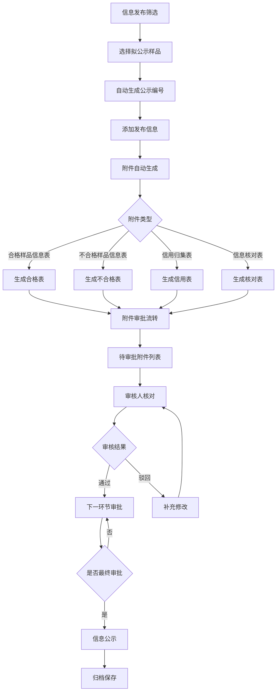
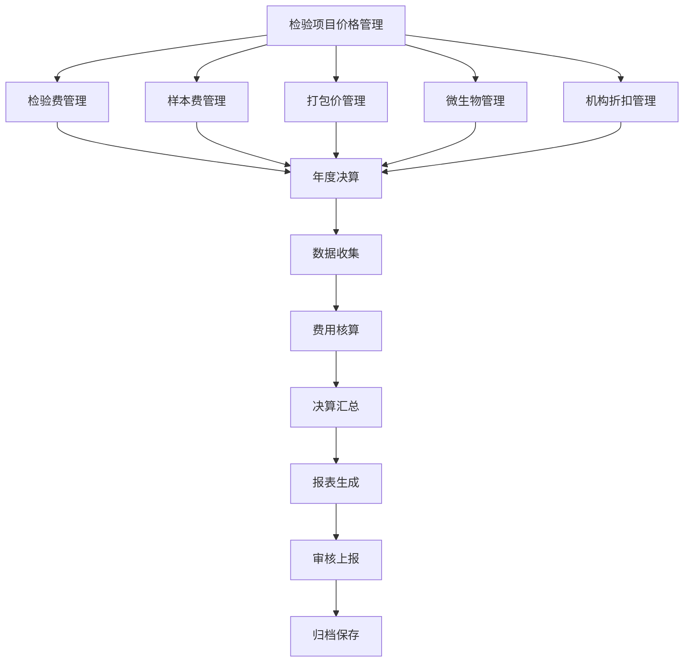
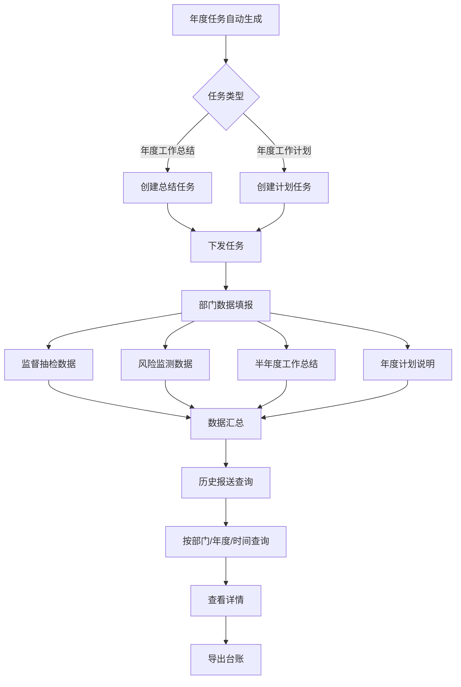

# 产品需求：北京市食品安全全链条数字化平台

## 1. 背景与目标
- **业务背景**：北京市食品安全全链条数字化平台旨在通过数字化手段实现食品安全抽检监测工作的全流程管理，解决传统抽检工作中数据分散、风险识别滞后、经费核算复杂、信息发布效率低等问题，提升食品安全监管的智能化和精细化水平。
- **项目目标**：本次交付的核心目标是构建一个完整的食品安全抽检监测数字化管理平台，涵盖计划制定、数据采集、风险监测、经费决算、信息发布、总结报送等核心业务环节，实现风险导向的抽检计划智能辅助制定、多维度的数据统计分析与可视化展示、实时风险监测与智能警示推送、规范的经费决算管理、高效的信息发布流程、完善的总结报送机制。

## 2. 目标用户
- **主要用户**：市局抽检处管理人员（负责制定抽检计划、审批经费决算、查看统计分析报告）、属地监管所抽检专员（执行抽检任务、录入数据、接收风险警示）、检验机构工作人员（管理检验项目、录入检验结果）、各业务处室用户（填报工作总结、参与附件审批）
- **用户特征**：技术水平中等，熟悉Windows操作系统和浏览器使用；使用频率高频（工作日每日使用）；核心诉求为数据准确、操作便捷、风险预警及时
- **次要用户**：分管领导（查看汇总报表、审批关键事项）、企业用户（查看抽检结果公示信息）

## 3. 核心任务
1. **抽检计划制定**：基于历史风险数据，智能辅助制定年度抽检计划
2. **数据统计分析**：多维度分析抽检数据，生成可视化报表和分析报告
3. **风险监测警示**：实时监测风险，自动触发警示并跟踪处置
4. **经费决算管理**：规范管理检验费用标准，自动生成年度决算报表
5. **信息发布管理**：筛选样品信息，自动生成附件，流转审批后公示
6. **总结报送管理**：自动生成任务，各部门填报数据，汇总查询

## 4. 功能流程

流程说明：

| 节点 | 说明 |
|------|------|
| 页面/功能 | 用户当前所处的页面或正在使用的功能 |
| 用户操作 | 触发流程的用户行为，如点击按钮、填写表单、选择筛选条件 |
| 条件判断 | 系统校验或业务规则判断，决定流程走向 |
| 功能处理 | 系统执行的核心逻辑，如数据计算、存储、调用接口 |
| 状态变更 | 数据或界面状态的变化 |
| 结果展示 | 成功后的界面反馈或页面流转 |
| 错误处理 | 不满足条件时的反馈方式和回流路径 |

### 4.1 页面级总流程

### 4.2 核心功能子流程

#### 4.2.1 抽检工作主流程

#### 4.2.2 风险警示流程

#### 4.2.3 信息发布流程

#### 4.2.4 经费决算流程

#### 4.2.5 总结报送流程

## 5. 功能清单
### 5.1 功能点列表
| 编号 | 功能点 | 优先级 | 说明 |
|------|--------|--------|------|
| F01 | 分析报表 | P0 | 7个Tab页多维度数据可视化分析 |
| F02 | 历史风险导向预设提醒规则管理 | P0 | 管理高频超标主体、季节周期、区域品类风险提醒规则 |
| F03 | 风险警示规则可视化自定义 | P0 | 可视化配置风险警示规则，支持库表拖拽、字段关联 |
| F04 | 警示规则执行与记录查询 | P0 | 查询规则执行日志和警示历史台账 |
| F05 | 检验费管理 | P1 | 管理检验费用标准，支持导入导出 |
| F06 | 样本费管理 | P1 | 管理样本购置费用标准 |
| F07 | 打包价管理 | P1 | 配置多项目组合检测的计价规则 |
| F08 | 年度决算管理 | P1 | 自动汇总年度抽检费用，生成决算报表 |
| F09 | 信息发布筛选与公示编号管理 | P1 | 筛选拟公示样品，自动生成公示编号 |
| F10 | 附件自动生成 | P1 | 根据模板自动生成合格/不合格样品表、信用归集表、信息核对表 |
| F11 | 附件审批流转管理 | P1 | 管理附件审批流程，支持意见填写和审批历史查看 |
| F12 | 年度任务自动生成 | P1 | 自动创建年度工作总结和计划任务 |
| F13 | 部门监督抽检数据填报 | P1 | 各部门填报监督抽检计划数和完成数 |
| F14 | 部门风险监测数据填报 | P1 | 各部门填报风险监测计划数和完成数 |
| F15 | 半年度工作总结填报 | P1 | 各部门填报半年度工作总结 |
| F16 | 年度计划说明填报 | P1 | 各部门填报年度计划说明 |
| F17 | 历史报送信息综合查询 | P1 | 查询各部门历次报送信息 |
| F18 | 检验项目别名管理 | P2 | 管理检测项目别名，规范决算分析 |
| F19 | 微生物管理 | P2 | 管理微生物检测项目及特殊规则 |
| F20 | 机构折扣管理 | P2 | 管理承检机构折扣信息 |
| F21 | 预设规则数据关联与提醒推送配置 | P2 | 配置规则数据关联和推送方式 |
| F22 | 数据资源库表可视化选择与关联配置 | P2 | 可视化选择库表并建立关联 |
| F23 | 判定字段选取与运算关系可视化定义 | P2 | 定义判定字段和运算关系 |
| F24 | 复杂运算与自定义函数支持 | P2 | 支持自定义运算公式和函数调用 |
| F25 | 规则执行策略配置 | P2 | 配置规则执行触发方式和范围 |
| F26 | 规则历史管理与复用 | P2 | 管理规则生命周期，支持复制和版本回滚 |
| F27 | 提醒推送与反馈跟踪 | P2 | 推送提醒信息并跟踪反馈状态 |
| F28 | 审批流程可视化设置 | P2 | 可视化自定义审批流程节点 |
| F29 | 分析报告 | P2 | 生成抽检分析报告 |
| F30 | 计划辅助制定 | P2 | 辅助制定年度抽检监测计划 |

### 5.2 功能点详细描述
#### F01 分析报表
- **需求描述**：提供7个维度的抽检数据可视化分析，支持Tab页切换查看，包括食品抽检整体情况、各地区食品抽检情况、各生产经营环节抽检情况、各食品类别抽检情况、各检验项目抽检情况、问题食品产地来源情况、网络平台抽检情况
- **功能设计**：单页面7个Tab页布局，每个Tab页包含筛选条件和图表展示区域，使用ECharts绘制柱状图、折线图、饼图等多种图表类型
- **操作流程**：选择Tab页 → 设置筛选条件 → 查看图表数据
- **功能交互**：点击Tab标签（
）→ 切换Tab内容（display切换）→ 重新初始化对应图表；输入"发现问题率阈值"（<input type="number" onchange>）→ 校验输入（仅允许整数）→ 图表数据过滤刷新；切换Tab4（食品类别抽检情况）→ 显示"食品类别"筛选下拉框（display:block）；切换Tab1（食品抽检整体情况）→ 隐藏"发现问题率阈值"筛选（display:none）
- **功能数据项**：发现问题率阈值（整数，范围0-100）、食品类别（下拉选择，关联食品类别表）
- **数据状态**：无特殊数据状态
- **约束条件**：无权限限制
- **排序规则**：按时间顺序展示数据

#### F02 历史风险导向预设提醒规则管理
- **需求描述**：管理预设提醒规则，支持新增、编辑、删除操作，规则类型包括高频超标主体提醒、季节周期风险提醒、区域品类风险提醒
- **功能设计**：列表页展示规则台账，弹窗表单进行规则配置，包含规则基本信息和判定条件配置
- **操作流程**：点击"新增规则" → 填写规则信息 → 配置触发条件 → 保存规则
- **功能交互**：点击"新增规则"按钮（<button onclick>）→ 打开规则配置弹窗（fadeIn动画）→ 表单初始化空值；点击"编辑"按钮（<button onclick>）→ 打开规则配置弹窗 → 加载现有规则数据；点击"保存"按钮（<button onclick>，按钮置灰防重复提交）→ 校验表单 → 保存规则 → 关闭弹窗 + 列表刷新 + Toast提示"保存成功"；点击"删除"按钮（<button onclick>）→ 确认弹窗 → 删除规则 → 列表刷新
- **功能数据项**：规则名称（文本，必填，最大50字符）、规则类型（单选：高频超标主体/季节周期风险/区域品类风险）、触发条件（数值/文本/时间型字段组合）、提醒内容（文本，必填）、优先级（单选：一级/二级）
- **数据状态**：规则状态（启用/禁用），启用状态显示"禁用"按钮，禁用状态显示"启用"按钮
- **约束条件**：仅管理员可新增/编辑/删除规则
- **排序规则**：按创建时间降序

#### F03 风险警示规则可视化自定义
- **需求描述**：可视化配置风险警示规则，支持库表选择、字段关联、数据预览，参照总局食品安全抽检监测发现严重风险快速应对机制要求
- **功能设计**：左侧库表列表、中间关联区、右侧字段列表和数据预览区，支持拖拽操作
- **操作流程**：拖拽库表到关联区 → 查看字段列表 → 拖拽字段建立关联 → 预览数据
- **功能交互**：拖拽库表卡片（
）→ 添加到规则数据来源区 → 自动展开字段列表；拖拽字段（
）→ 建立跨表关联 → 显示关联线；点击"预览"按钮（<button onclick>）→ 加载表内示例数据 → 显示数据表格；点击"字段筛选"按钮（<button onclick>）→ 打开筛选面板 → 设置筛选条件 → 数据过滤
- **功能数据项**：库表名称（系统预设数据资源库表）、字段列表（自动展示库表所有字段，包含名称、类型）、关联关系（字段匹配建立的表间关联）
- **数据状态**：无特殊数据状态
- **约束条件**：仅管理员可配置规则
- **排序规则**：库表按名称升序，字段按名称升序
- **其他细节**：支持字段筛选缩小数据范围，支持跨表取数时通过字段匹配拖拽方式建立关联

#### F04 警示规则执行与记录查询
- **需求描述**：查询规则执行日志和警示历史台账，支持关联查看原始抽检数据与处置报告，形成完整追溯链
- **功能设计**：双Tab页布局（执行日志/警示台账），支持条件查询和详情查看
- **操作流程**：选择Tab页 → 设置查询条件 → 点击查询 → 查看结果列表 → 点击查看详情
- **功能交互**：输入查询条件（<input onchange>）→ 点击"查询"按钮 → 列表数据刷新；点击"查看详情"（<button onclick>）→ 打开详情弹窗 → 加载完整记录信息；点击"导出台账"（<button onclick>）→ 生成Excel文件 → 触发浏览器下载；点击"查看原始数据"（<button onclick>）→ 跳转至抽检数据详情页
- **功能数据项**：规则名称（模糊查询）、执行时间（时间范围）、警示编号（精确查询）、推送对象（选择查询）、处置结果（选择查询）
- **数据状态**：警示状态（已查看/已派单/已处置），不同状态显示不同操作按钮
- **约束条件**：用户仅可查看本部门相关记录
- **排序规则**：按执行时间/接收时间降序

#### F05 检验费管理
- **需求描述**：管理检验费用标准，支持新增、编辑、删除、导入导出，查询条件字段包括报送分类、检验项目名称、年份
- **功能设计**：查询区域 + 操作按钮 + 数据表格 + 弹窗表单，结果列表展示字段包括报送分类名称、检验项目名称、检验依据、单价、年份、备注
- **操作流程**：设置查询条件 → 点击查询 → 查看结果 → 点击新增/编辑 → 填写表单 → 保存
- **功能交互**：点击"新增"按钮（<button onclick>）→ 打开编辑弹窗 → 表单初始化空值；点击"编辑"按钮（<button onclick>）→ 打开编辑弹窗 → 加载现有数据；点击"保存"按钮（<button onclick>）→ 校验表单 → 保存数据 → 关闭弹窗 + 列表刷新；点击"模板下载"（<button onclick>）→ 下载Excel模板文件；点击"数据导入"（<input type="file" onchange>）→ 解析文件 → 批量导入数据；点击"批量导出"（<button onclick>）→ 导出选中数据为Excel文件
- **功能数据项**：报送分类（下拉选择）、检验项目名称（文本，必填）、检验依据（文本，必填）、单价（数值，必填，>0）、年份（选择，必填）、备注（文本）
- **数据状态**：无特殊数据状态
- **约束条件**：单价必须大于0
- **排序规则**：按年份降序、检验项目名称升序

#### F06 样本费管理
- **需求描述**：管理样本购置费用标准，支持新增、编辑、导入导出，查询条件字段包括报送分类、食品大类、年份
- **功能设计**：查询区域 + 操作按钮 + 数据表格 + 弹窗表单，结果列表展示字段包括报送分类名称、食品大类名称、食品亚类名称、食品次亚类名称、食品细类名称、单价、年份
- **操作流程**：设置查询条件 → 点击查询 → 查看结果 → 点击新增/编辑 → 填写表单 → 保存
- **功能交互**：与检验费管理一致
- **功能数据项**：报送分类（下拉选择）、食品大类/亚类/次亚类/细类（级联选择）、单价（数值，必填，>0）、年份（选择，必填）
- **数据状态**：无特殊数据状态
- **约束条件**：单价必须大于0
- **排序规则**：按年份降序、食品大类升序

#### F07 打包价管理
- **需求描述**：配置多项目组合检测的计价规则，通过单项选择与已选列表方式确定组合内项目，支持设置累加价格与最高限价参数
- **功能设计**：左侧可选项目列表 + 右侧已选项目列表 + 参数配置区
- **操作流程**：选择检验项目 → 添加到已选列表 → 设置累加价格和最高限价 → 保存规则
- **功能交互**：双击可选项目（<tr ondblclick>）→ 移动到已选列表 → 可选列表移除该项目；双击已选项目（<tr ondblclick>）→ 移动回可选列表 → 已选列表移除该项目；输入参数（<input onchange>）→ 实时显示计算结果；点击"保存"按钮（<button onclick>）→ 校验表单 → 保存规则 → 列表刷新
- **功能数据项**：打包规则名称（文本，必填）、已选检验项目（多选）、累加价格（数值，>0）、最高限价（数值，>=累加价格）
- **数据状态**：无特殊数据状态
- **约束条件**：最高限价必须大于等于累加价格
- **排序规则**：按创建时间降序

#### F08 年度决算管理
- **需求描述**：自动汇总年度抽检费用，生成决算汇总表和分析报告，查询条件包括样本数量、异常四级分类、异常检测项目名称、检测费原价、检测费折后价、采样费计算总价、采样费修改后总价、折前总费用、折后总费用等
- **功能设计**：查询区域 + 汇总表格 + 分析图表 + 报告生成按钮，支持按标题字段排序
- **操作流程**：设置查询条件 → 点击查询 → 查看汇总表 → 生成分析报告
- **功能交互**：点击"查询"按钮（<button onclick>）→ 加载决算数据 → 显示汇总表格；点击"生成分析报告"（<button onclick>）→ 生成费用占比图表 → 显示报告内容；点击表头字段（<th onclick>）→ 按该字段排序（升序/降序切换）；表格行悬停（<tr onmouseover>）→ 高亮显示 → 显示详情提示
- **功能数据项**：样本数量（范围查询）、异常四级分类（选择查询）、检测项目名称（模糊查询）、费用范围（数值范围）、年度（选择查询）
- **数据状态**：无特殊数据状态
- **约束条件**：仅管理员可查看全量数据
- **排序规则**：支持按各字段升序/降序排序

#### F09 信息发布筛选与公示编号管理
- **需求描述**：筛选拟公示样品信息，自动生成公示编号，查询条件字段包括抽样时间范围、食品大类、被抽样单位名称、判定结论
- **功能设计**：查询区域 + 样品列表 + 公示编号生成 + 发布信息管理
- **操作流程**：设置筛选条件 → 点击查询 → 选择样品 → 生成公示编号 → 添加发布信息
- **功能交互**：勾选样品复选框（<input type="checkbox" onchange>）→ 批量选择 → 启用"生成公示编号"按钮；点击"生成公示编号"（<button onclick>）→ 自动生成编号 → 更新样品列表显示；点击"添加发布信息"（<button onclick>）→ 打开发布信息表单 → 填写并保存；点击"查看详情"（<button onclick>）→ 打开样品详情弹窗 → 显示完整样品信息
- **功能数据项**：抽样时间范围（日期范围）、食品大类（选择查询）、被抽样单位名称（模糊查询）、判定结论（选择：合格/不合格）、公示编号（系统自动生成）、发布状态（系统自动更新：未公示/已公示）
- **数据状态**：发布状态（未公示/已公示），已公示状态显示"查看公示"按钮
- **约束条件**：无特殊约束
- **排序规则**：按抽样时间降序

#### F10 附件自动生成
- **需求描述**：根据预设模板自动生成发布附件，附件类型包括合格样品信息表、不合格样品信息表、信用归集表、各处室各机构及外省信息核对表四种
- **功能设计**：样品列表 + 附件类型选择 + 生成按钮 + 附件下载
- **操作流程**：选择样品 → 选择附件类型 → 点击生成 → 下载附件
- **功能交互**：选择附件类型（<select onchange>）→ 显示对应模板预览；点击"生成附件"（<button onclick>）→ 后台生成文件 → 显示下载链接；点击"下载"链接（<a href>）→ 触发文件下载；点击"查看处置详情"（<button onclick>）→ 打开样品详情弹窗 → 显示处置信息
- **功能数据项**：附件类型（单选：合格样品信息表/不合格样品信息表/信用归集表/信息核对表）、样品范围（已选样品）、生成时间（系统自动记录）
- **数据状态**：无特殊数据状态
- **约束条件**：必须选择至少一个样品才能生成附件
- **排序规则**：按生成时间降序

#### F11 附件审批流转管理
- **需求描述**：管理附件审批流程，审批人可核对附件中不合格样品的复检情况信息，支持对附件内容进行补充修改，系统自动记录各审批环节的审批意见、审批人姓名、审批时间
- **功能设计**：待审批列表 + 审批表单 + 审批历史记录
- **操作流程**：查看待审批列表 → 点击审批 → 核对内容 → 填写意见 → 选择审批结果
- **功能交互**：点击"审批"按钮（<button onclick>）→ 打开审批表单 → 加载附件内容；选择审批结果（<select onchange>）→ 显示对应操作按钮；点击"通过"（<button onclick>）→ 保存审批意见 → 更新状态 → 推送下一审批人；点击"驳回"（<button onclick>）→ 保存驳回意见 → 更新状态 → 通知提交人；点击"查看历史"（<button onclick>）→ 显示审批历史记录列表；点击"常用意见模板"（<button onclick>）→ 显示模板列表 → 选择模板 → 填充审批意见
- **功能数据项**：审批意见（文本，必填，驳回时）、审批结果（单选：通过/驳回）、审批时间（系统自动记录）、审批人（系统自动记录）、附件内容（只读查看）
- **数据状态**：审批状态（待审批/审批中/已通过/已驳回），不同状态显示不同操作按钮
- **约束条件**：审批人必须具有对应审批权限
- **排序规则**：按提交时间降序

#### F12 年度任务自动生成
- **需求描述**：系统自动创建年度工作总结和计划任务，并向指定部门下发，记录任务名称、任务年度、下发部门、任务状态、创建时间等字段信息
- **功能设计**：任务列表 + 创建任务表单 + 下发功能
- **操作流程**：点击"创建任务" → 选择任务类型和年度 → 选择下发部门 → 下发任务
- **功能交互**：点击"创建任务"按钮（<button onclick>）→ 打开任务创建表单；选择任务类型（<select onchange>）→ 显示对应表单字段；点击"下发任务"（<button onclick>）→ 保存任务 → 通知下发部门 → 任务状态更新；点击"查看详情"（<button onclick>）→ 打开任务详情弹窗 → 显示任务信息和下发记录
- **功能数据项**：任务名称（文本，必填）、任务年度（选择，必填）、任务类型（单选：年度工作总结/年度工作计划）、下发部门（多选）、任务状态（系统自动更新：待下发/已下发/已完成）、创建时间（系统自动记录）
- **数据状态**：任务状态（待下发/已下发/已完成），待下发状态显示"下发"按钮，已下发状态显示"催办"按钮
- **约束条件**：仅管理员可创建和下发任务
- **排序规则**：按创建时间降序

#### F13 部门监督抽检数据填报
- **需求描述**：各部门填报监督抽检工作的量化指标，可填写的字段包括监督抽检计划数、监督抽检实际完成数，系统记录填报人姓名、填报部门名称、填报时间
- **功能设计**：填报表单 + 统计展示（计划总数、实际完成数、完成率、已填报部门数）
- **操作流程**：进入填报页面 → 填写数据 → 点击提交
- **功能交互**：输入数据（<input type="number" onchange>）→ 实时校验（非负整数）→ 实时计算完成率；点击"提交"按钮（<button onclick>）→ 校验表单 → 保存数据 → Toast提示"提交成功"；点击"查看历史"（<button onclick>）→ 显示历史填报记录列表
- **功能数据项**：监督抽检计划数（整数，>=0）、监督抽检实际完成数（整数，>=0，<=计划数）、填报人（系统自动记录）、填报部门（系统自动记录）、填报时间（系统自动记录）
- **数据状态**：填报状态（未填报/已填报/已审核），已审核状态数据不可修改
- **约束条件**：实际完成数不能超过计划数；仅本部门用户可填报本部门数据
- **排序规则**：按填报时间降序

#### F14 部门风险监测数据填报
- **需求描述**：各部门填报风险监测工作的量化指标，可填写的字段包括风险监测计划数、风险监测实际完成数，系统记录填报人姓名、填报部门名称、填报时间
- **功能设计**：填报表单 + 统计展示（计划总数、实际完成数、完成率、已填报部门数）
- **操作流程**：进入填报页面 → 填写数据 → 点击提交
- **功能交互**：与监督抽检数据填报一致
- **功能数据项**：风险监测计划数（整数，>=0）、风险监测实际完成数（整数，>=0，<=计划数）、填报人（系统自动记录）、填报部门（系统自动记录）、填报时间（系统自动记录）
- **数据状态**：填报状态（未填报/已填报/已审核），已审核状态数据不可修改
- **约束条件**：实际完成数不能超过计划数；仅本部门用户可填报本部门数据
- **排序规则**：按填报时间降序

#### F15 半年度工作总结填报
- **需求描述**：各部门填报半年度工作完成情况描述文本，内容涵盖工作成效、遇到问题、典型经验等，系统记录提交时间与提交人信息
- **功能设计**：文本编辑器 + 提交功能
- **操作流程**：进入填报页面 → 填写工作总结 → 点击提交
- **功能交互**：输入文本（<textarea oninput>）→ 实时字数统计；点击"提交"按钮（<button onclick>）→ 校验内容不为空 → 保存数据 → Toast提示"提交成功"；点击"保存草稿"（<button onclick>）→ 保存草稿 → 可继续编辑
- **功能数据项**：工作成效（文本，必填，至少100字）、遇到问题（文本，必填，至少100字）、典型经验（文本，必填，至少100字）、提交时间（系统自动记录）、提交人（系统自动记录）
- **数据状态**：填报状态（未填报/已保存草稿/已提交/已审核），已审核状态数据不可修改
- **约束条件**：每项内容至少100字；仅本部门用户可填报本部门数据
- **排序规则**：按提交时间降序

#### F16 年度计划说明填报
- **需求描述**：各部门填报下一年度工作计划说明文本，内容包括工作思路、重点方向、目标设定依据等，系统记录提交时间与提交人信息
- **功能设计**：文本编辑器 + 提交功能
- **操作流程**：进入填报页面 → 填写计划说明 → 点击提交
- **功能交互**：与半年度工作总结填报一致
- **功能数据项**：工作思路（文本，必填，至少100字）、重点方向（文本，必填，至少100字）、目标设定依据（文本，必填，至少100字）、提交时间（系统自动记录）、提交人（系统自动记录）
- **数据状态**：填报状态（未填报/已保存草稿/已提交/已审核），已审核状态数据不可修改
- **约束条件**：每项内容至少100字；仅本部门用户可填报本部门数据
- **排序规则**：按提交时间降序

#### F17 历史报送信息综合查询
- **需求描述**：查询各部门历次报送信息，市局抽检处用户可查询全部门数据，各部门用户可查询本部门数据，查询条件字段包括报送部门名称、任务年度、报送时间段
- **功能设计**：查询区域 + 结果列表 + 详情弹窗
- **操作流程**：设置查询条件 → 点击查询 → 查看结果 → 点击查看详情
- **功能交互**：输入查询条件（<input onchange>）→ 点击"查询"按钮 → 列表数据刷新；点击"查看详情"（<button onclick>）→ 打开详情弹窗 → 显示完整报送信息（监督抽检数据、风险监测数据、工作总结、工作计划）；点击"导出台账"（<button onclick>）→ 生成Excel文件 → 触发下载
- **功能数据项**：报送部门名称（选择查询）、任务年度（选择查询）、报送时间段（日期范围）、报送批次号（系统自动生成）、填报完成状态（系统自动更新）、提交时间（系统自动记录）
- **数据状态**：填报完成状态（未完成/已完成），未完成状态显示红色标识
- **约束条件**：市局用户可查看全部门数据，部门用户仅可查看本部门数据
- **排序规则**：按提交时间降序

#### F18 检验项目别名管理
- **需求描述**：管理检测项目的别名，统一规范决算分析时的抽样表数据处理，支持新增、编辑、删除别名和计算规则配置
- **功能设计**：列表页展示别名台账，弹窗表单进行别名配置，包含别名基本信息和计算规则配置
- **操作流程**：点击"新增别名" → 填写别名信息 → 配置计算规则 → 保存
- **功能交互**：点击"新增别名"按钮（<button onclick>）→ 打开别名配置弹窗 → 表单初始化空值；点击"编辑"按钮（<button onclick>）→ 打开别名配置弹窗 → 加载现有别名数据；点击"删除"按钮（<button onclick>）→ 确认弹窗 → 删除别名；点击"配置计算规则"（<button onclick>）→ 打开计算规则配置面板 → 设置计算逻辑
- **功能数据项**：别名名称（文本，必填）、标准检测项目名称（关联选择，必填）、计算规则（下拉选择或自定义表达式）、备注（文本）
- **数据状态**：关联状态（已关联/未关联），已关联状态显示关联的抽样表数量
- **约束条件**：别名名称不能重复
- **排序规则**：按创建时间降序
- **其他细节**：系统将配置完成的别名与抽样表数据自动关联，决算分析时自动识别检测项目对应的别名并调用预设计算规则处理数据

#### F19 微生物管理
- **需求描述**：管理微生物检测项目，查询条件字段包括微生物项目名称、检验依据，支持项目新增与编辑操作，支持单项导出与批量导出，提供特殊规则设置入口
- **功能设计**：查询区域 + 操作按钮 + 数据表格 + 弹窗表单
- **操作流程**：设置查询条件 → 点击查询 → 查看结果 → 点击新增/编辑 → 填写表单 → 保存
- **功能交互**：点击"新增"按钮（<button onclick>）→ 打开编辑弹窗 → 表单初始化空值；点击"编辑"按钮（<button onclick>）→ 打开编辑弹窗 → 加载现有数据；点击"特殊规则设置"（<button onclick>）→ 打开特殊规则配置面板 → 设置特殊计算规则和价格；点击"导出"（<button onclick>）→ 导出数据为Excel文件
- **功能数据项**：微生物项目名称（文本，必填）、检验依据（文本，必填）、标准价格（数值，>0）、特殊规则（下拉选择）、特殊规则价格（数值，>0）、备注（文本）
- **数据状态**：无特殊数据状态
- **约束条件**：标准价格必须大于0
- **排序规则**：按项目名称升序
- **其他细节**：针对特定微生物检测项目可配置特殊计算规则及对应的特殊规则价格

#### F20 机构折扣管理
- **需求描述**：管理各承检机构的折扣信息，查询条件字段包括机构名称、折扣适用年限范围，支持设置机构折扣率数值与机构折扣适用年限起止日期
- **功能设计**：查询区域 + 操作按钮 + 数据表格 + 弹窗表单
- **操作流程**：设置查询条件 → 点击查询 → 查看结果 → 点击新增/编辑 → 填写表单 → 保存
- **功能交互**：点击"新增"按钮（<button onclick>）→ 打开编辑弹窗 → 表单初始化空值；点击"编辑"按钮（<button onclick>）→ 打开编辑弹窗 → 加载现有数据；点击"保存"按钮（<button onclick>）→ 校验表单 → 保存数据 → 列表刷新
- **功能数据项**：机构名称（关联选择，必填）、折扣率（数值，0-100）、适用年限起（日期，必填）、适用年限止（日期，必填）、备注（文本）
- **数据状态**：有效状态（有效/过期），过期状态显示灰色标识
- **约束条件**：折扣率必须在0-100之间；适用年限止必须大于适用年限起
- **排序规则**：按适用年限起降序

#### F21 预设规则数据关联与提醒推送配置
- **需求描述**：配置规则与数据的关联关系及提醒推送方式，关联数据表包括历史抽检结果表、风险趋势分析表、区域品类风险统计表
- **功能设计**：数据关联配置区 + 推送配置区
- **操作流程**：选择关联数据表 → 配置字段映射 → 设置推送参数 → 保存配置
- **功能交互**：勾选关联数据表（<input type="checkbox" onchange>）→ 显示字段映射配置；设置字段映射（<select onchange>）→ 保存映射关系；选择提醒等级（<select onchange>）→ 显示对应推送配置；选择推送对象（<select onchange>）→ 配置推送渠道
- **功能数据项**：关联数据表（多选）、字段映射（键值对）、提醒等级（单选：一级/二级）、推送对象（多选）、推送渠道（多选：系统消息/短信/京办助手）
- **数据状态**：无特殊数据状态
- **约束条件**：一级提醒必须包含短信通知
- **排序规则**：无特殊排序

#### F22 数据资源库表可视化选择与关联配置
- **需求描述**：可视化方式选择数据资源库表并建立关联，库表涵盖历史数据类和实时数据类，支持拖拽操作、数据预览和字段筛选
- **功能设计**：左侧库表列表 + 中间关联区 + 右侧字段列表和数据预览区
- **操作流程**：拖拽库表到关联区 → 查看字段列表 → 拖拽字段建立关联 → 预览数据
- **功能交互**：与风险警示规则可视化自定义一致
- **功能数据项**：库表名称（系统预设数据资源库表）、字段列表（自动展示库表所有字段）、关联关系（字段匹配建立的表间关联）
- **数据状态**：无特殊数据状态
- **约束条件**：仅管理员可配置
- **排序规则**：库表按名称升序
- **其他细节**：支持跨表取数时通过字段匹配拖拽方式建立关联，支持字段筛选缩小数据范围

#### F23 判定字段选取与运算关系可视化定义
- **需求描述**：定义规则判定字段和运算关系，字段类型包括数值型、文本型、时间型，支持拖拽选择和条件组合
- **功能设计**：左侧字段列表（按类型分类）+ 中间条件配置区 + 右侧运算关系面板
- **操作流程**：选择字段类型 → 拖拽字段到条件区 → 配置运算关系 → 添加条件 → 组合条件
- **功能交互**：点击字段类型标签（<button onclick>）→ 切换字段列表；拖拽字段（
）→ 添加到条件配置区；选择运算符（<select onchange>）→ 显示对应输入控件；点击"添加条件"（<button onclick>）→ 添加新条件行；点击"且/或"按钮（<button onclick>）→ 设置条件组合逻辑；点击"上移/下移"按钮（<button onclick>）→ 调整条件优先级
- **功能数据项**：字段名称（系统预设）、字段类型（数值型/文本型/时间型）、运算符（等于/包含/大于/小于/时间差等）、对比值（数值/文本/日期）、条件逻辑（且/或）
- **数据状态**：无特殊数据状态
- **约束条件**：至少需要一个条件
- **排序规则**：按条件优先级排序

#### F24 复杂运算与自定义函数支持
- **需求描述**：支持自定义运算公式和函数调用，系统提供常用函数库，包含计数函数、平均值函数、最大值函数等
- **功能设计**：左侧函数库列表 + 中间表达式编辑区 + 右侧字段列表
- **操作流程**：选择函数 → 拖拽到表达式区 → 配置参数 → 预览计算结果
- **功能交互**：点击函数分类（<button onclick>）→ 展开函数列表；拖拽函数（
）→ 添加到表达式编辑区；双击字段（<tr ondblclick>）→ 添加到表达式编辑区；点击"预览"（<button onclick>）→ 计算并显示结果；点击"验证"（<button onclick>）→ 校验表达式语法
- **功能数据项**：函数名称（系统预设）、函数参数（字段或常量）、自定义表达式（文本）、计算结果（实时预览）
- **数据状态**：无特殊数据状态
- **约束条件**：表达式语法必须正确
- **排序规则**：函数按分类排序

#### F25 规则执行策略配置
- **需求描述**：配置规则执行方式，触发方式包括定时执行（月/季/年）、事件触发、手动触发，执行范围可限定为全区域或特定区域、全品类或特定品类
- **功能设计**：触发方式配置区 + 执行范围配置区 + 容错设置区
- **操作流程**：选择触发方式 → 配置执行参数 → 设置执行范围 → 配置容错选项 → 保存配置
- **功能交互**：选择触发方式（<select onchange>）→ 显示对应配置项；设置定时参数（<input onchange>）→ 保存定时规则；选择执行范围（<select onchange>）→ 显示范围选择器；选择容错方式（<select onchange>）→ 保存容错配置；点击"立即执行"（<button onclick>）→ 手动触发规则执行 → 显示执行结果
- **功能数据项**：触发方式（单选：定时执行/事件触发/手动触发）、执行周期（月/季/年）、执行日期（日期选择）、执行范围（全区域/特定区域/全品类/特定品类）、容错方式（单选：跳过缺失数据/按默认值判定）
- **数据状态**：执行状态（运行中/已停止），运行中状态显示"停止"按钮
- **约束条件**：定时执行必须设置执行日期
- **排序规则**：无特殊排序

#### F26 规则历史管理与复用
- **需求描述**：管理规则的完整生命周期，支持复制规则、查看历史版本、一键回滚
- **功能设计**：规则台账列表 + 操作按钮 + 历史版本弹窗
- **操作流程**：查看规则台账 → 点击复制/查看历史版本 → 操作
- **功能交互**：点击"复制规则"（<button onclick>）→ 复制规则配置到新规则 → 打开新规则编辑页面；点击"历史版本"（<button onclick>）→ 打开历史版本弹窗 → 显示版本列表；点击"回滚"（<button onclick>）→ 确认弹窗 → 回滚到指定版本；点击"查看详情"（<button onclick>）→ 显示版本详细信息（修改人、修改时间、修改内容摘要）
- **功能数据项**：规则名称、创建人、创建时间、规则类型、执行状态、最近执行时间、累计触发次数、版本号、修改人、修改时间、修改内容摘要
- **数据状态**：规则状态（启用/禁用）、版本状态（当前版本/历史版本）
- **约束条件**：仅管理员可复制和回滚规则
- **排序规则**：按创建时间降序
- **其他细节**：规则修改后系统自动保存新版本，记录修改人、修改时间、修改内容摘要，支持查看历史版本并一键回滚

#### F27 提醒推送与反馈跟踪
- **需求描述**：推送提醒信息并跟踪反馈，推送渠道包括系统消息、短信通知，反馈状态包括已纳入计划、暂缓纳入、无需纳入
- **功能设计**：提醒列表 + 推送操作 + 反馈处理
- **操作流程**：查看提醒列表 → 手动发送提醒 → 处理反馈
- **功能交互**：点击"手动发送提醒"（<button onclick>）→ 选择推送对象 → 发送提醒 → 更新推送状态；点击"查看详情"（<button onclick>）→ 打开提醒详情弹窗 → 显示关联历史数据；点击反馈按钮（<button onclick>）→ 填写说明 → 保存反馈 → 更新反馈状态
- **功能数据项**：提醒编号、规则名称、提醒内容摘要、推送对象、接收时间、反馈状态（已纳入计划/暂缓纳入/无需纳入）、反馈说明、反馈时间、反馈人
- **数据状态**：反馈状态（未反馈/已纳入计划/暂缓纳入/无需纳入），不同状态显示不同操作按钮
- **约束条件**：一级提醒同步触发短信通知
- **排序规则**：按接收时间降序
- **其他细节**：提醒内容附带查看详情按钮，点击可跳转至关联历史数据页面；用户选择反馈状态后需填写简要说明，系统自动记录反馈信息，形成提醒到反馈的闭环管理

#### F28 审批流程可视化设置
- **需求描述**：可视化自定义审批流程，监管人员通过拖拽方式完成流程节点的新增、删除与顺序调整，可为每个节点配置对应的审批角色
- **功能设计**：流程画布区 + 节点配置面板 + 流程预览区
- **操作流程**：拖拽节点到画布 → 配置节点属性 → 连接节点 → 预览流程 → 保存流程
- **功能交互**：拖拽节点（
）→ 添加到流程画布；点击节点（
）→ 打开节点配置面板 → 设置节点名称、类型、审批角色；拖拽连接线（<svg onmousedown>）→ 连接两个节点；点击"删除节点"（<button onclick>）→ 移除节点及连接线；点击"预览"（<button onclick>）→ 显示流程预览图；点击"保存"（<button onclick>）→ 保存流程配置
- **功能数据项**：节点名称、节点类型（开始节点/处室审核/机构审核/领导审批/结束节点）、审批角色（多选）、节点顺序、连接线关系
- **数据状态**：流程状态（启用/禁用），启用状态的流程不可修改
- **约束条件**：流程必须包含开始节点和结束节点；至少需要一个审核节点
- **排序规则**：按节点顺序排序

#### F29 分析报告
- **需求描述**：生成抽检分析报告，支持自定义报告内容，提供历年决算表汇总分析报告模板设置，支持生成检测项目费用占比分析图表与任务费用占比分析图表
- **功能设计**：报告模板选择 + 内容配置 + 报告预览 + 导出功能
- **操作流程**：选择报告模板 → 配置报告内容 → 预览报告 → 导出报告
- **功能交互**：选择报告模板（<select onchange>）→ 加载模板配置；勾选报告章节（<input type="checkbox" onchange>）→ 配置报告内容；点击"预览"（<button onclick>）→ 生成报告预览；点击"导出"（<button onclick>）→ 生成PDF/Word文件 → 触发下载
- **功能数据项**：报告模板（系统预设）、报告章节（多选）、报告标题（文本）、报告时间范围（日期范围）、报告图表（多选）
- **数据状态**：无特殊数据状态
- **约束条件**：必须选择至少一个报告章节
- **排序规则**：按报告生成时间降序

#### F30 计划辅助制定
- **需求描述**：辅助制定年度抽检监测计划，提供历史数据参考、风险导向提醒、计划编制模板，支持多维度配置条件
- **功能设计**：左侧配置条件区 + 中间数据可视化区 + 右侧计划结果输出区
- **操作流程**：配置条件 → 查看数据可视化 → 生成计划 → 导出计划文档
- **功能交互**：勾选规则卡片（<input type="checkbox" onchange>）→ 展开规则配置；拖动滑块（<input type="range" oninput>）→ 实时显示数值；点击"生成计划"（<button onclick>）→ 计算计划数据 → 更新结果输出区；点击"导出计划文档"（<button onclick>）→ 生成计划文档 → 触发下载；点击"导出报表"（<button onclick>）→ 生成Excel报表 → 触发下载
- **功能数据项**：年度总抽检批次（整数，>=0）、季度分配比例（数组，合计100%）、业态分类占比（数组，合计100%）、专项任务（多选）、专项批次总量（整数，>=0）
- **数据状态**：无特殊数据状态
- **约束条件**：季度分配比例合计必须为100%；业态分类占比合计必须为100%
- **排序规则**：无特殊排序

## 6. 内容与数据
- **数据来源**：真实数据（抽检结果数据、企业信息数据、检验项目数据）、示例数据（系统初始化时的演示数据）、接口（与其他系统对接获取外部数据）
- **素材来源**：用户提供（需求文档、业务规则说明、业态分类数据）、主题资源（系统统一设计规范）
- **数据总览**：核心数据表包括抽检结果表（抽样编号、食品名称、检测指标、检测值、限值、判定结论、抽样时间）、企业信息表（企业名称、统一社会信用代码、生产地址、信用等级、业态分类）、检验项目表（项目名称、项目类别、检验依据、检验方法、单价）、经费决算表（检验项目名称、单价、数量、费用金额、年度）、风险规则表（规则名称、规则类型、判定条件、执行策略、状态）、警示记录表（警示编号、规则名称、警示内容、推送对象、反馈状态、接收时间）、报送信息表（报送批次号、部门名称、年度、监督抽检数据、风险监测数据、工作总结）、附件表（附件编号、样品范围、附件类型、生成时间、审批状态）

## 7. 页面与状态
- **页面列表**：分析报表（pages/analysis_report.html，F01）、历史风险导向预设提醒规则管理（pages/plan_smart/risk_rule_manage.html，F02）、风险警示规则可视化自定义（pages/risk/risk_rule_visual.html，F03）、警示规则执行与记录查询（pages/risk/risk_record_query.html，F04）、检验费管理（pages/finance/fee_manage.html，F05）、样本费管理（pages/finance/sample_fee.html，F06）、打包价管理（pages/finance/package_price.html，F07）、年度决算管理（pages/finance/annual_settlement.html，F08）、信息发布筛选与公示编号管理（pages/publish/publish_filter.html，F09）、附件自动生成（pages/publish/attachment_generate.html，F10）、附件审批流转管理（pages/publish/attachment_approval.html，F11）、年度任务自动生成（pages/report/task_generate.html，F12）、部门监督抽检数据填报（pages/report/supervision_report.html，F13）、部门风险监测数据填报（pages/report/risk_report.html，F14）、半年度工作总结填报（pages/report/halfyear_summary.html，F15）、年度计划说明填报（pages/report/annual_plan.html，F16）、历史报送信息综合查询（pages/report/history_query.html，F17）、检验项目别名管理（pages/finance/alias_manage.html，F18）、微生物管理（pages/finance/microbe_manage.html，F19）、机构折扣管理（pages/finance/institution_discount.html，F20）、预设规则数据关联与提醒推送配置（pages/plan_smart/rule_data_config.html，F21）、数据资源库表可视化选择与关联配置（pages/plan_smart/data_source_config.html，F22）、判定字段选取与运算关系可视化定义（pages/plan_smart/judge_field_config.html，F23）、复杂运算与自定义函数支持（pages/plan_smart/complex_func.html，F24）、规则执行策略配置（pages/plan_smart/rule_exec_config.html，F25）、规则历史管理与复用（pages/plan_smart/rule_history.html，F26）、提醒推送与反馈跟踪（pages/plan_smart/alert_feedback.html，F27）、审批流程可视化设置（pages/publish/approval_flow.html，F28）、分析报告（pages/analysis_report_detail.html，F29）、计划辅助制定（pages/plan_assist.html，F30）
- **核心路径**：计划制定路径（计划智能辅助管理 → 规则配置 → 生成计划 → 下发执行）、抽检执行路径（抽样检验 → 数据录入 → 结果分析 → 风险警示 → 信息发布）、经费管理路径（价格管理 → 数据归集 → 年度决算 → 报表生成 → 审核上报）
- **页面状态**：空状态（无数据时显示空状态提示和操作指引）、加载中（数据请求时显示加载动画）、错误状态（数据请求失败时显示错误提示和重试按钮）、成功状态（操作成功后显示成功提示）
- **边界情况**：极端数据（大数据量表格使用分页和虚拟滚动）、特殊权限（无权限用户访问受限页面时显示权限不足提示）、并发操作（同一数据被多人编辑时提示冲突）、弹窗内容溢出（使用滚动条确保完整显示）

## 8. 范围与边界
- **本轮做**：统计分析模块（分析报表、分析报告）、计划智能辅助管理模块（8个子页面）、经费决算管理模块（7个子页面）、监测风险警示模块（7个子页面）、监测结果信息发布管理模块（4个子页面）、监测总结和计划报送管理模块（6个子页面）、计划辅助制定页面
- **本轮不做**：移动端适配、数据可视化大屏展示、与外部系统的实时数据同步、高级数据分析功能（机器学习预测）、全流程电子签章
- **后续规划**：移动端App开发、数据可视化大屏、AI辅助风险预测、全流程电子签章、与外部系统实时数据同步